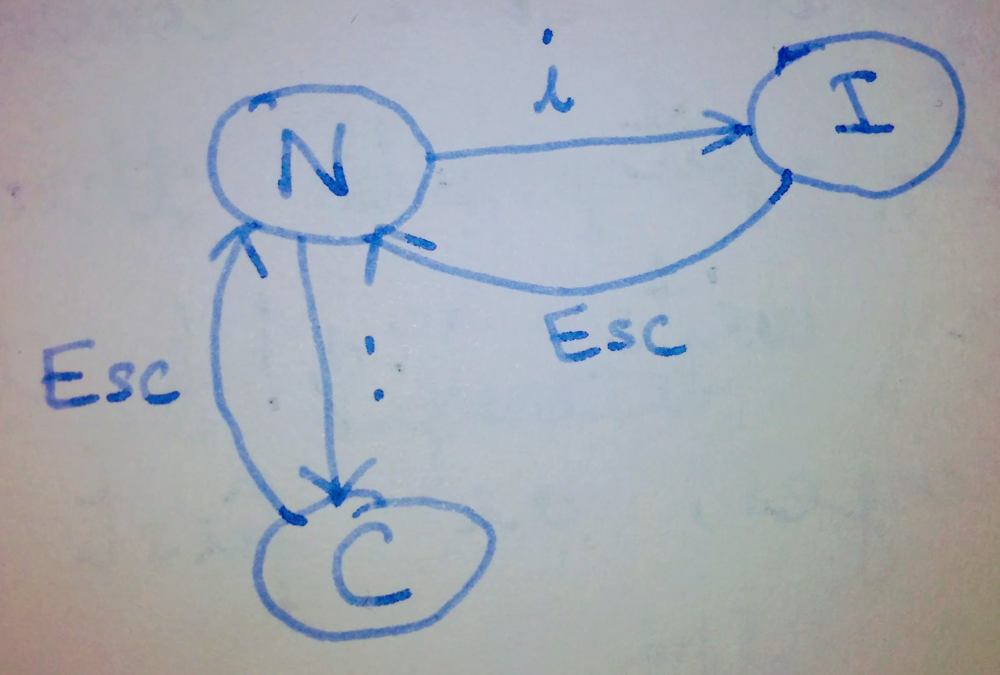

## Learn Vim - Module 1: (Not just an) Intro

[Home](https://github.com/manasthakur/learn-vim/)  |  [Next module](module2.md)

[Vim](http://www.vim.org/) is a command-line text editor, created by [Bram Moolenar](http://www.moolenaar.net/).
It stands for _Vi-IMproved_; _Vi_ was an older ubiquitous editor, which was enhanced to create Vim.

To open Vim, just type `vim` at the command-prompt.
Note that on most modern systems, `vi` is symlinked to `vim`.
However, just in case the symlink does not exist, I recommend typing the whole word `vim`.

To open a file in the beginning, type `vim file-name` at the command-prompt.
To open a file inside vim, type:
```
:e file_name	" 'e' stands for 'edit'
```

Vim is a _modal_ text-editor.
That is, it has different modes to perform different tasks.
The major ones (for now) are:

* Normal (N) -- edit text
* Insert (I) -- type text
* Command-line (C) -- execute commands

The following diagram shows how to switch from one mode to the other:



The _default mode_ when we open vim is the _Normal_ mode.

To start typing like other non-modal editors (e.g., gedit), just press `i` in normal mode, which will land you into the _Insert_ mode.
Once typing is over, we can _save_ the text by typing `w` in _Command-line_ mode and pressing `Enter` (CR or carriage-return):
```
<Esc>:w<CR>    " <Esc>: the Escape key; <CR>: the Enter key
```
Note that the above command lands us back into normal mode; thus, to start typing text again, we need to press `i` again.

To _quit_ vim, type either `q` in command-line mode, or `ZZ` in normal mode:
```
<Esc>:q<CR>  or  <Esc>ZZ    " Quit vim
```
We can _save-and-quit_ by combining the keystrokes for write (w) and quit (q) in command-line mode:
```
:wq    " Save-and-quit. From now on, we will omit writing the prefix <Esc> and the suffix <CR>.
```
If you try to quit vim when some contents in the open file are _unsaved_, vim will throw an error.
In such a case, either write `:q!` to quit without saving the changes, or first save (using `:w`) then quit.

##### Extra dose:
1. The command `:x` is a shorthand for `:wq`.
2. The command `:up` (for _update_) writes the file to disk only if the file has unsaved changes.

### Configuring Vim
Vim has many configuration options, which can be
* enabled for the current instance of vim by setting them in command-line mode (e.g., `set option`)
* enabled across all the instances of vim by writing them in the _vimrc file_.

The default location of the vimrc file is:
```
$HOME/.vimrc    " hidden file
```
We can simply list the options, one per line, in the vimrc file, like this:
```vim
" This is a comment
set option1    " This is also a comment
set option2
...
```
Note that the vimrc file can be commented using the double-quotes (") character.

Some _useful options_ to set in the vimrc file are as follows:

* `set ruler` -- show the current line-number, current column-number, etc. in the status-line (bottom) of vim.
* `set number` -- show line-numbers in the LHS.
* `syntax on` or `syntax enable` -- enable syntax-based coloring in different files, based on the extension.
* `set tabstop=4` -- use 4 characters for tab.
* `set expandtab` -- replace tab character (`\t` literal) with 4 spaces.

#### Endnote:
In this module, we learned about some basic operations that allow us to _type_ neatly in vim.
This is already enough to get you started with using Vim instead of other simple editors (such as TextEdit in macOS).
In the next module, we will learn about working with multiple files in Vim, _simultaneously_!

[Home](https://github.com/manasthakur/learn-vim/)  |  [Next module](module2.md)

[Star this repository](https://github.com/manasthakur/learn-vim/) on GitHub if you like the tutorial.
[Follow me](https://twitter.com/manasthakur17) on twitter for updates.

